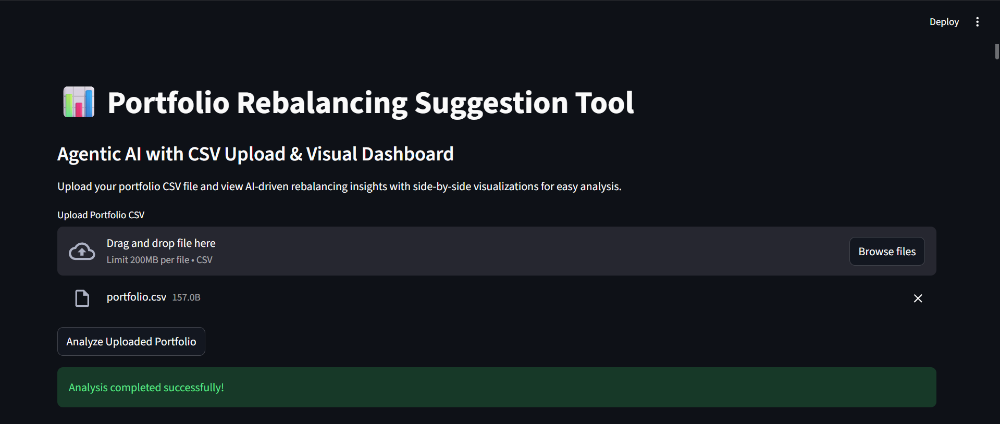
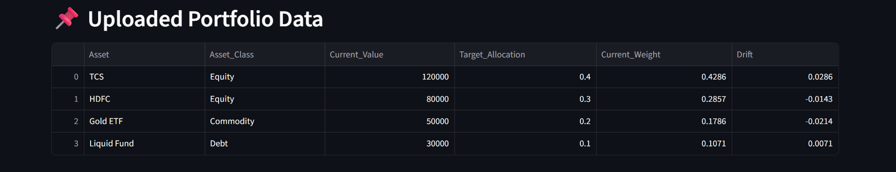
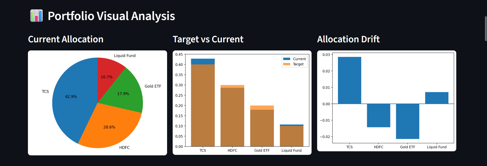
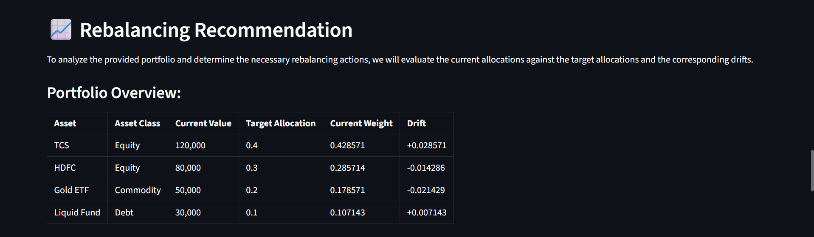

# 📊 Portfolio Rebalancing Suggestion Tool  
## Agentic AI using Pandas + LLM Reasoning
---

## 📌 Project Overview

This project presents an **Agentic AI–based Portfolio Rebalancing Suggestion Tool** that analyzes investment portfolios using **Pandas** and generates **explainable rebalancing recommendations** using **Large Language Model (LLM) reasoning**.

The system combines quantitative data analysis with qualitative AI reasoning to simulate how a financial advisor evaluates portfolio allocation drift and suggests corrective actions. The results are displayed through an interactive **Python-based Streamlit web dashboard** with clear visualizations.

---

## 🎯 Problem Statement

Many retail investors struggle to rebalance their portfolios due to lack of financial expertise and analytical tools. Manual analysis is time-consuming and often lacks clarity, while automated tools usually fail to explain *why* decisions are made.

This project solves the problem by integrating:
- **Data-driven portfolio analysis**
- **Agentic AI reasoning**
- **Explainable AI outputs**
- **Visual analytics for easy understanding**

---

## 🧠 Core Concepts Used

- **Agentic AI**  
  The LLM acts as an autonomous reasoning agent that observes portfolio data, applies financial rules, makes decisions, and explains them clearly.

- **Multi-step Prompt Engineering**  
  The reasoning process is divided into:
  1. Portfolio analysis  
  2. Rebalancing decision reasoning  
  3. Investor-friendly explanation  

- **Explainable AI (XAI)**  
  Every recommendation is supported by a clear natural language explanation.

- **Pandas-based Analytics**  
  Used for allocation calculation, drift detection, and portfolio metrics.

---

## 🏗️ System Architecture

            User CSV Upload
                  ↓
      Pandas Portfolio Analyzer
                  ↓
      Allocation Drift Detection
                  ↓
      LLM Reasoning Agent (Agentic AI)
                  ↓
      Rebalancing Decision + Explanation
                  ↓
      Streamlit Web Dashboard (Visual Output)

---

## ✨ Features

✔ Upload custom portfolio CSV  
✔ Automatic allocation & drift calculation  
✔ Agentic AI–based rebalancing suggestions  
✔ Side-by-side visualizations  
✔ Investor-friendly explanations  
✔ Modular and clean Python code  

---

## 📂 Project Structure

    Portfolio-Rebalancing-Agent/
    │
    ├── agent/
    │ ├── analyzer.py # Portfolio analysis using Pandas
    │ ├── reasoning_agent.py # LLM-based reasoning agent
    │ └── prompt_templates.py # Multi-step prompt templates
    │
    ├── data/
    │ └── portfolio_sample.csv # Sample dataset
    │
    ├── knowledge_base/
    │ ├── rebalancing_rules.txt # Financial rebalancing rules
    │ └── risk_profiles.txt # Risk profile knowledge
    │
    ├── app.py # Backend logic (terminal + callable)
    ├── web_app.py # Streamlit web application
    ├── requirements.txt
    └── README.md

---

## 📄 Dataset Description

The project uses a structured CSV portfolio dataset with the following required columns:

| Column | Description |
|------|-------------|
| Asset | Name of the investment |
| Asset_Class | Equity / Debt / Commodity |
| Current_Value | Current invested amount |
| Target_Allocation | Desired portfolio weight |

### Sample CSV
    csv file

    Asset,Asset_Class,Current_Value,Target_Allocation
    TCS,Equity,150000,0.25
    INFY,Equity,120000,0.20
    HDFC Bank,Equity,100000,0.15
    Reliance,Equity,90000,0.15
    Gold ETF,Commodity,80000,0.15
    Liquid Fund,Debt,60000,0.10

--- 

## 📊 Visualizations

Current Portfolio Allocation (Pie Chart)

Target vs Current Allocation (Bar Chart)

Allocation Drift – Overweight / Underweight (Bar Chart)

All charts are displayed side by side for easy comparison and analysis.

---

## 🚀 How to Run the Project
### 1️⃣ Clone the Repository
git clone https://github.com/DEV-BHAVSAR0077/Portfolio-Rebalancing-Agent.git
cd Portfolio-Rebalancing-Agent

### 2️⃣ Install Dependencies
pip install -r requirements.txt

### 3️⃣ Run the Web Application
streamlit run web_app.py

### 4️⃣ Upload CSV and Analyze

Upload a portfolio CSV file

Click Analyze Uploaded Portfolio

View AI recommendations and visual insights

--- 

## 🧪 Example Output

Detects overweight equity exposure

Identifies underweighted debt allocation

Suggests rebalancing actions

Explains decisions in simple, investor-friendly language

---

## 🧠 Agentic AI Explanation

“The LLM in this project functions as a reasoning agent. It analyzes portfolio metrics, applies financial rules, makes rebalancing decisions, and explains them using multi-step reasoning rather than simple text generation.”

### ⚠️ Limitations

Uses static portfolio data

Target allocations are user-defined

No live market data integration

### 🔮 Future Enhancements

Live market data APIs

Risk-profile–based dynamic targets

PDF report export

Portfolio history tracking

RAG with vector databases

---

## Outputs

---

## 📜 Conclusion

This project demonstrates how Agentic AI, combined with data analytics and visualization, can deliver an explainable and practical financial decision-support system. It bridges numerical analysis with human-understandable reasoning, making AI-driven finance more transparent and accessible.

---

## 👨‍💻 Author

Dev Bhavsar

M.Sc. Data Science

Agentic AI | Machine Learning | Data Analytics

---

### ⭐ If you find this project useful, consider giving it a star on GitHub.
